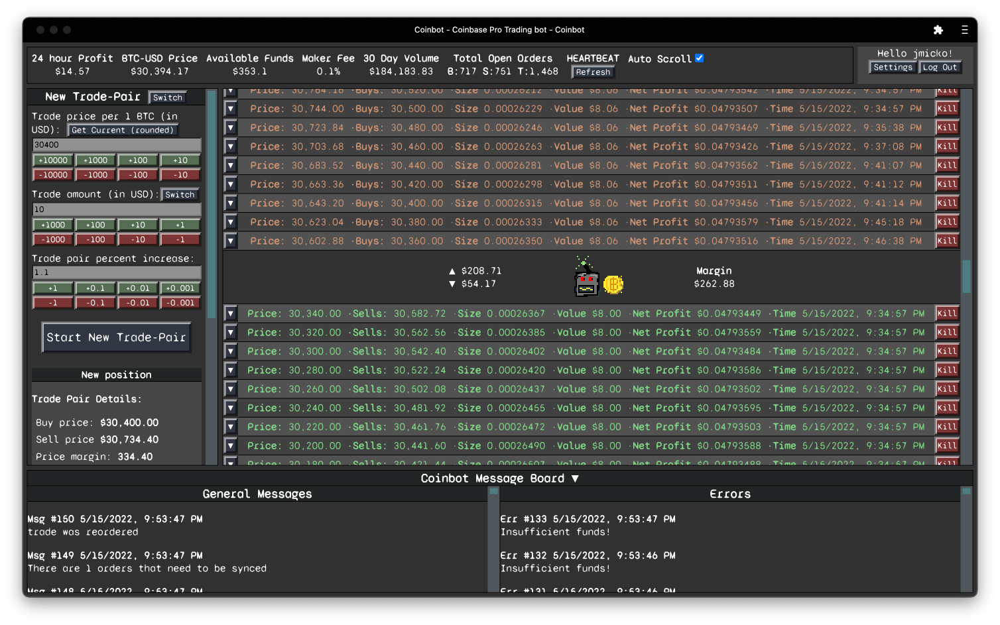

# Coinbot

Coinbot is a Bitcoin trading bot project built for the Coinbase Pro cryptocurrency exchange. 



The strategy is based on the creation of trade-pair values, and is very similar to a grid bot with a little more control. A trade-pair is the combination of two precalculated order price positions, a "buy" price and a "sell" price, that are stored in the coinbot's local database. The buy price should always be lower than the sell price, and the difference between the two should cover the cost of exchange fees. The bot keeps track of which "side" (buy or sell) is currently on order on Coinbase. each order is stored locally with the original buy and sell values. When the coinbot detects a trade has settled on the exchange, it flips sides on the trade by creating a new trade on the other side. 

When a "buy" is settled, another order will immediately be placed as a "sell" at a higher price and vice versa. The prices of each of these orders are stored as the values of the trade-pair. When a buy order and a sell order each go through from the same trade-pair values, a profit is made. The two transactions that contributed to the profit are the trade-pair. 

The volume of the trade-pair does not matter so much, as fees are calculated by percentage. A smaller volume allows for greater distribution of trade-pair positions across a wider price range, and will better cover the high price volatility of Bitcoin. A higher volume will produce greater profits, assuming the price of Bitcoin stays withing the range of the bot.

Placing dozens of trade-pairs at many different price points allows the bot to capture smaller but more frequent profits. The huge price swings that occasionally make someone rich are notable in their own light, but do not happen frequently at all when compared to the smaller $400 - $3,000 swings that happen on a daily basis. The coinbot does not care, and allows for both of these strategies to work.

For example: A trade-pair could be set up between the prices of $10,000 and $100,000, and return a huge profit if the price of Bitcoin hits both sides. Or it could be set up between $30,000 and $31,000 for much smaller, but more frequent profits as the price staggers past them. In testing, the latter strategy has shown to be effective.

But again, the coinbot does not care, nor do the developers. 

However, a higher amount of open trades does increase the amount of processing done by the bot. The effects of this are unknown, but this is not a high-speed bot on a Wall Street exchange. It was made for a slow and unreliable home internet connection. On that note, one of the developers uses a satellite connection (Starlink) and a Raspberry Pi. It hasn't been an issue. The bot keeps local copies of the trades it makes, places limit orders, and does not rely on the ability to react quickly to incoming market data. If the internet connection is cut off, the limit orders will still go through on Coinbase, and the bot will simply check and react to them later when the internet is restored. Delayed reactions to rapid price movements can result in taker fees being charged on trades, which should be taken into account when deciding the trade-pair percent increase.

## `DISCLAIMER`

This is an experimental bot. It requires a connection to a Coinbase Pro account, and has the ability to handle real money. Coinbase provides a sandbox API for testing purposes. It is recommended only to use the sandbox API with this bot as a demonstration of what is possible with the Coinbase API. Any use of the software provided in this repository is the responsibility of the user, and the developers of the software cannot be held responsible for any financial operations made with the software, or harm done to your computer as a result of using the software. Use of this software does not come with any guarantee of profits, losses, fees, taxes, or other financial consequences. Bitcoin and other cryptocurrencies may be taxed. Trading cryptocurrency is a risk taken by those making the trades. No financial advice is given in regards to the use of this software. Your portfolio can always go to zero.

You trade at your own risk.

There are also currently no security features built in to the coinbot other than basic password protection. Hosting in the cloud or on any device that can be accessed from the internet, from an intranet, or by anyone who you do not want to be able access it is not recommended.

## Advantages

This is a fairly low-risk strategy, as it requires no statistical analysis or market data. There is no risk of guessing trends incorrectly because the coinbot does not guess. It works off of predetermined prices. Profits are made when the price of Bitcoin passes the "buy" and "sell" prices of a trade-pair in that order. If left alone, the coinbot will do this automatically at the set price points as long as the price of bitcoin is hitting them. The coinbot actually benefits from higher volatility and large fast price swings because it increases the chances that the trade-pair values will be hit.

## Disadvantages

A notable disadvantage of this strategy is that when the price takes a sharp upward trend, the coinbot will sell at a fixed price regardless. This slows down the potential rate of profits compared to strategies that attempt to calculate the tops and bottoms of market curves. 

It also does not take into account market volumes, or the bird-themed social media accounts of billionaire entrepreneurs. That's not what this project is about. :bird:

## `Features`

### Web-based Interface
Use and configuration of the coinbot is done from a web app in the browser. This includes user registration and api details. It is mobile responsive, and works great as a progressive web app.

### Create New Trade Pairs
New trade-pair values can be individually created from the main interface. There is a calculator to determine both sides of the trade-pair, and estimate fees and profits. Note that these are an estimation, and nothing is guaranteed.

### Auto Setup
There is a function in the settings that will allow you to input the desired parameters, and automatically place up to 10,000 trades (the maximum allowed) for you. This is much easier than manually entering them when they will all have similar values.

### Auto Fee Detection
Coinbot will check the current fees for the connected account and adjust the numbers in the calculator to match. This makes it easier to calculate profits before starting a trade-pair. When calculating profits, Coinbot will use the exact fees reported by coinbase, which accounts for moving into different fee tiers, or instances where a taker fee was charged.

### Total Profit Estimation
There is an estimation of how much "profit" the bot has generated since it was first run (assuming you don't drop the tables). This is a total of the difference between the buy and sell values minus the fees for all trade-pairs that have completed a full buy/sell cycle. It is not reflective of how much money is in your account, nor is it reflective of capital gains in the eyes of the IRS. Do not use this info when reporting taxes. Coinbot is unable to assist you with your taxes in any way.

### Open Order Book
A list of all open orders is shown as the main content of the page. This list will update live as the bot makes trades. Coinbase only allows a certain number of orders to be placed at any time, so the bot handles synchronization automatically and shows you your full order book. This will look different from what is reported by Coinbase, which is why trading on the Coinbase platform directly should be avoided in your Coinbot portfolio.

### Profit Reinvestment
Users can set a percentage of profits from each trade-pair that will be automatically reinvested back into the pair.

This makes for an interesting strategy because the bot will reinvest profits right around the price that Bitcoin is actively trading at, potentially increasing returns faster than if the profit was spread out evenly among all active trade pairs.

This can be above 100%, which can help distribute a new deposit amongst many trades that have already been placed. Setting a 'reserve' amount in the Investment tab in the settings will attempt to stop reinvestment if the available balance goes below the reserve amount. There are unavoidable situations where the available balance may go below the reserve, so it is best to set this value above 0 if reinvestment is set above 100%.

A maximum trade size can also be set, and the bot will adjust the reinvestment behavior on a trade-pair when it reaches this value. This can be a different reinvestment value, or nothing and the bot will keep the profits.

### Multi-user Authentication
The bot can handle multiple users at once. The first user created will be the admin and can approve and manage the other users.

### Admin Controls
The admin account can control settings that affect resource usage, as well as approving or deleting users.

## `Important notes`
- The coinbot will detect any trading action placed on the Coinbase website manually from the connected Coinbase account, and cancel those orders. Orders cannot be placed or deleted on Coinbase. That must be done from the coinbot interface. It is recommended to create a separate profile on Coinbase exclusively for Coinbot or you will not be able to do anything on your own.

# `Setup`

## Prerequisites

Before you get started, make sure you have the following software installed on your computer:

- [Node.js](https://nodejs.org/en/)
- [PostrgeSQL](https://www.postgresql.org/)
- [Nodemon](https://nodemon.io/) - optional, but included in the yarn script

### Database
Postgresql should be setup and a new database should be created with the name "coinbot". There is a database.sql file that can be used to generate the required tables.

### .env file
- A .env file should be created at the base of the file tree. Copy the following into the file and replace the info inside the quotes with the correct info for your setup. PG info is the username and password used for access to Postgres. Server session secret should be a long string that is not easily guessed. If you do not change it, anyone with this repo will be able to guess it.

```
    PGUSER='postgresUsernameGoesHere'
    PGPASSWORD='postgresPasswordGoesHere'
    SERVER_SESSION_SECRET='pleaseForTheLoveOfMoneyPutADifferentSecretHere'
```    

## Available Scripts

In the project directory, you can run:

### `yarn server`

Runs the express server in the backend.\
This is where the coinbot lives, and must be done.

### `yarn start`

Runs the web app interface in the development mode.\
Open [http://localhost:3000](http://localhost:3000) to view it in the browser.

The page will reload if you make edits.\
You will also see any lint errors in the console.\
Nodemon is required for this script.

<!-- ### `yarn test`

Launches the test runner in the interactive watch mode.\
See the section about [running tests](https://facebook.github.io/create-react-app/docs/running-tests) for more information. -->

### `yarn build`

Builds the app for production to the `build` folder.\
It correctly bundles React in production mode and optimizes the build for the best performance.

The build is minified and the filenames include the hashes.\
Your app is ready to be deployed!

See the section about [deployment](https://facebook.github.io/create-react-app/docs/deployment) for more information.

### `yarn eject`

**Note: this is a one-way operation. Once you `eject`, you can’t go back!**

If you aren’t satisfied with the build tool and configuration choices, you can `eject` at any time. This command will remove the single build dependency from your project.

Instead, it will copy all the configuration files and the transitive dependencies (webpack, Babel, ESLint, etc) right into your project so you have full control over them. All of the commands except `eject` will still work, but they will point to the copied scripts so you can tweak them. At this point you’re on your own.

You don’t have to ever use `eject`. The curated feature set is suitable for small and middle deployments, and you shouldn’t feel obligated to use this feature. However we understand that this tool wouldn’t be useful if you couldn’t customize it when you are ready for it.

# Technologies used

- Node.js
- Express.js
- Socket.io
- Postgresql and PG
- React
- Redux
- This project was bootstrapped with [Create React App](https://github.com/facebook/create-react-app).